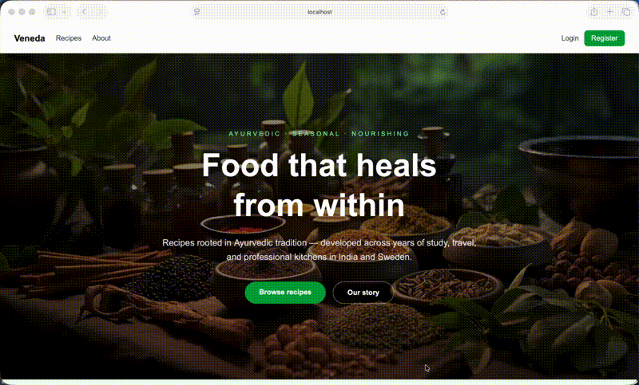
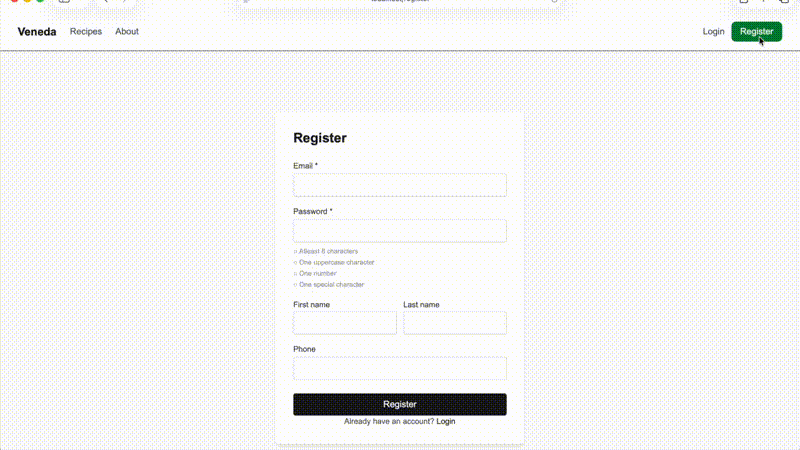
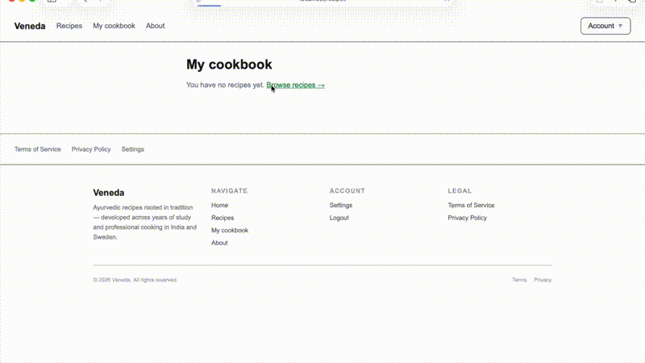
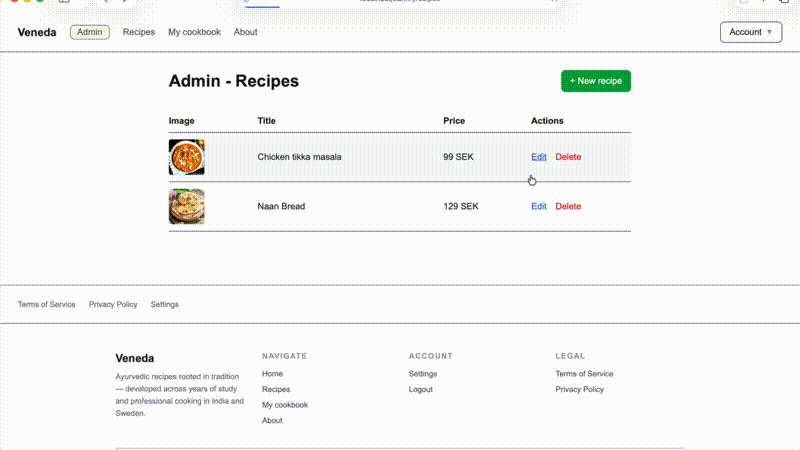
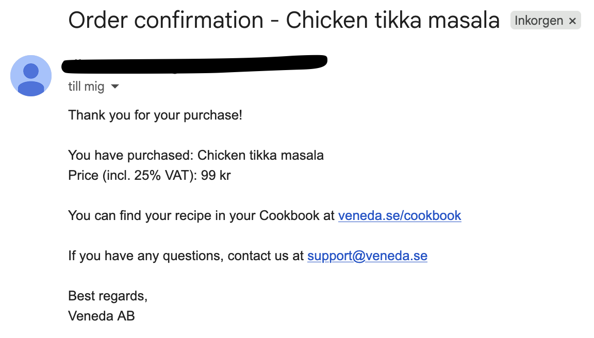
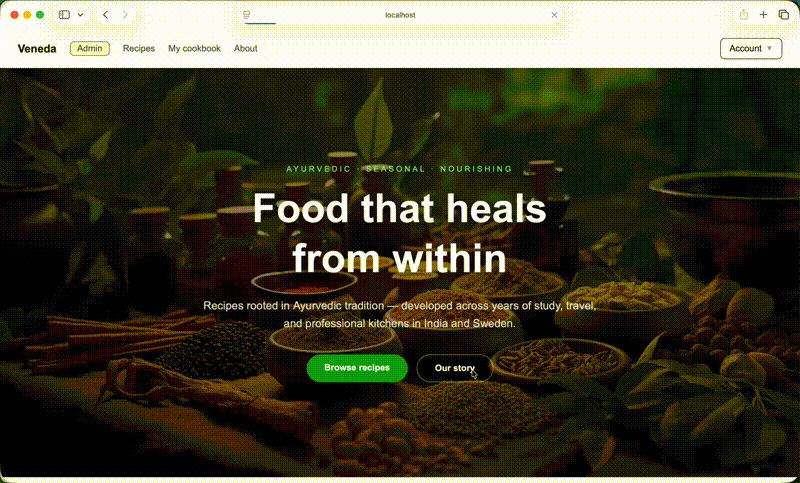

# Veneda

A full-stack e-commerce platform for selling Ayurvedic recipes, built with Next.js, Spring Boot, PostgreSQL, and Stripe.



---

## Features

- Browse and purchase digital recipes via Stripe Checkout
- JWT authentication with access & refresh tokens
- Personal cookbook — purchased recipes available instantly after payment
- Order confirmation emails sent on successful purchase
- Admin panel for creating, editing, and deleting recipes
- GDPR-compliant account deletion (anonymization per Swedish accounting law)
- AWS S3 for recipe image storage
- Deployed with Docker, Nginx, and Let's Encrypt SSL

---

## GIF & Screenshots

| Register | Purchase flow |
|----------|--------------|
|  |  |

| Admin — edit recipe | Confirmation email |
|--------------------|--------------------|
|  |  |



---

## Tech stack

| Layer     | Technology                                          |
|-----------|-----------------------------------------------------|
| Frontend  | Next.js, TypeScript, Tailwind CSS                   |
| Backend   | Java, Spring Boot, Spring Security, JPA             |
| Database  | PostgreSQL                                          |
| Payments  | Stripe (Checkout + Webhooks)                        |
| Storage   | AWS S3                                              |
| Email     | Spring Mail                                         |
| Proxy     | Nginx                                               |
| SSL       | Certbot / Let's Encrypt                             |
| Tests     | JUnit 5, Mockito                                    |

---

## Project structure

```
veneda/
├── backend/        # Spring Boot API
├── frontend/       # Next.js app
├── nginx/          # Nginx config + Certbot volumes
├── db/             # init.sql
├── docker-compose.yml
└── .env            # Environment variables (see below)
```

---

## Getting started

### 1. Clone the repo

```bash
git clone <repo-url>
cd veneda
```

### 2. Create a `.env` file in the project root

```env
# Database
POSTGRES_DB=veneda_db
POSTGRES_USER=your_user
POSTGRES_PASSWORD=your_password

# JWT
JWT_SECRET=a-long-random-secret-string

# Stripe
STRIPE_SECRET_KEY=sk_test_...
STRIPE_WEBHOOK_SECRET=whsec_...

# AWS S3
AWS_ACCESS_KEY=...
AWS_SECRET_ACCESS_KEY=...
AWS_REGION=eu-north-1
AWS_S3_BUCKET=veneda-images

# URLs (local)
CORS_ORIGINS=http://localhost
FRONTEND_URL=http://localhost
```

### 3. Start the stack

```bash
docker compose up --build
```

The app is available at **http://localhost**

---

## Stripe webhooks (local development)

Install the [Stripe CLI](https://stripe.com/docs/stripe-cli) and run:

```bash
stripe listen --forward-to localhost/api/stripe/webhooks
```

Copy the printed `whsec_...` value into your `.env` as `STRIPE_WEBHOOK_SECRET`, then restart the stack.

Use Stripe's test card `4242 4242 4242 4242` (any future date, any CVC) to simulate a purchase.

---

## Payment flow

1. User browses recipes at `/recipes`
2. User clicks a recipe → `/recipes/[id]`
3. User accepts withdrawal consent and clicks **Buy now** → redirected to Stripe Checkout
4. On success → redirected to `/cookbook`
5. Stripe sends a webhook → backend records the purchase and sends a confirmation email
6. Recipe is now available in the user's cookbook

---

## Admin

Admins can manage recipes at `/admin/recipes`.

To grant a user admin access, set their `user_role` to `ADMIN` directly in the database:

```sql
UPDATE users SET user_role = 'ADMIN' WHERE email = 'your@email.com';
```

---

## Production deployment

1. Point your domain's DNS to your server
2. Update `.env` with production values (`CORS_ORIGINS`, `FRONTEND_URL`, `DOMAIN`, etc.)
3. Use `nginx/nginx.conf` (with SSL) instead of `nginx.local.conf`
4. Issue SSL certificates:
   ```bash
   docker compose run --rm certbot certonly --webroot -w /var/www/certbot -d yourdomain.com
   ```
5. Start the stack:
   ```bash
   docker compose up -d --build
   ```
